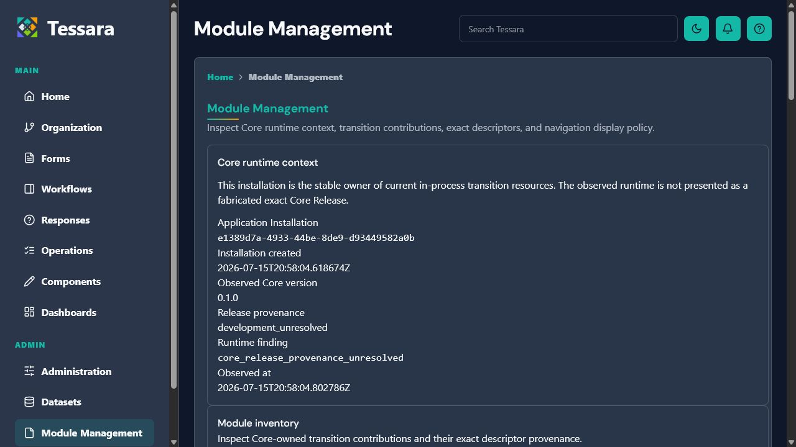
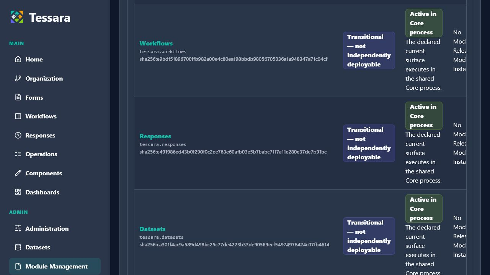
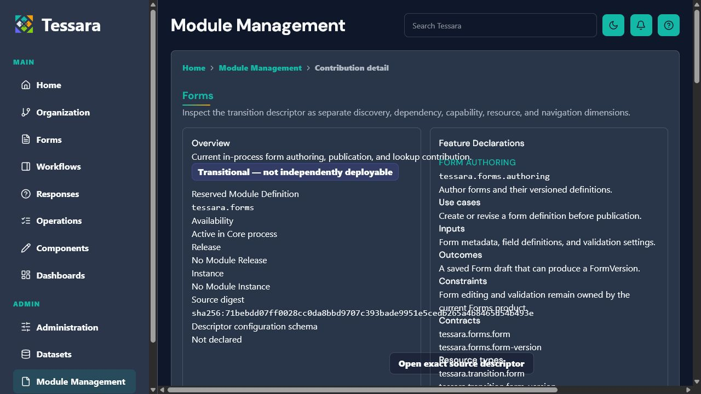
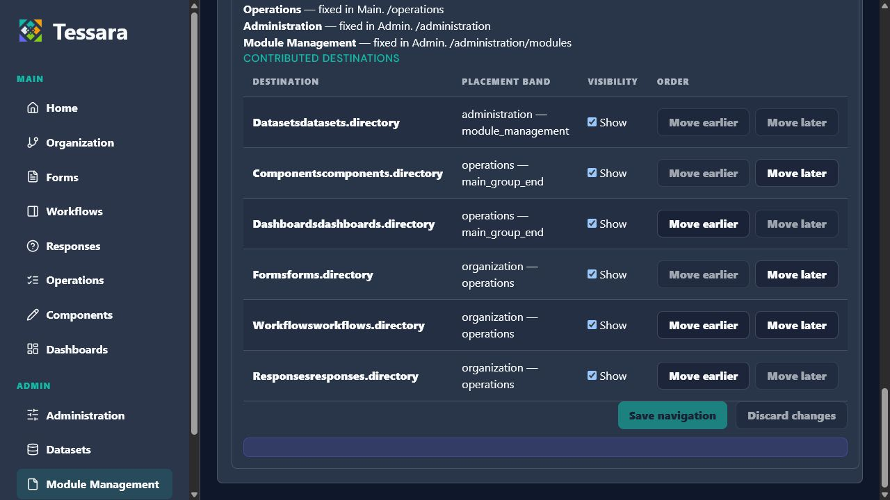

# Sprint 6A-UI Module Management Audit

Date: 2026-07-15

Target: live seeded Sprint 6A application at `http://localhost:8080`

Viewport: 1280×720

Persona/theme: seeded administrator, dark theme
Scope: Module Management UI introduced in Sprint 6A; existing Tessara shell and pages are references only.

## Audit Goal

Identify presentation defects that prevent a clean, legible Module Management reader/manager experience without changing content, behavior, navigation, authorization, APIs, persistence, or module contracts.

## Captures

### Directory first viewport

- Strengths: the existing Tessara shell, breadcrumb, page header, region heading, descriptive copy, and exact runtime values are present.
- Risk: Core runtime context occupies most of the first viewport, pushing the primary inventory task below the fold.
- Target: retain every value and the unresolved-provenance caveat in a more compact established metadata treatment.

### Directory inventory

- Strengths: the inventory is a real table with headers, row headers, exact definition IDs/digests, explicit transition type, availability, Release/Instance absence, and finding counts.
- Risk: the five-column structure cannot accommodate full machine values and verbose state explanations at 1280px. Columns clip horizontally and the rows become hard to associate.
- Target: preserve complete data and semantic relationships while establishing primary/secondary hierarchy, safe wrapping, and supported-viewport containment.

### Module detail

- Strengths: Overview and Feature Declarations are separate labeled regions; lifecycle and exact descriptor information remain visible.
- Risk: the generic two-column grid allows long content to overlap between cards, the exact-source action collides with content, and the page gains a horizontal scrollbar.
- Target: use an established stacked/wide responsive detail composition with long-value containment; do not hide or invent descriptor data.

### Navigation policy

- Strengths: permanent versus contributed destinations, placement bands, visibility, order actions, and save/discard controls remain explicit. Disabled actions and exact route/band information are present.
- Risk: labels and destination IDs run together; placement bands wrap unpredictably; repeated actions make rows dense and difficult to scan.
- Target: preserve policy semantics, action availability, order, focus restoration, and authorization while applying established stacked-label/action patterns.

## Accessibility Observations

- Current DOM inspection confirms useful landmarks, headings, regions, table headers, row headers, links, buttons, labels, and explicit status text.
- Color is not the sole carrier of lifecycle meaning; badge labels must remain.
- Page-level horizontal overflow and overlapping content materially impair keyboard, zoom, and narrow-viewport use.
- Full keyboard order, focus visibility/restoration, contrast, 200% zoom, screen-reader output, tablet/mobile layout, reduced motion, and both themes require focused validation after a design option is selected. Screenshots alone do not prove those requirements.

## Bounded Recommendation

Harmonize the directory, detail, and policy controls with existing Tessara cards, information lists, tables, status badges, action groups, and responsive rules. Add only scoped Module Management styles or minimal existing-pattern support. Do not redesign the shell, navigation, unrelated pages, or product workflows.

The prioritized implementation issues and proof requirements are maintained in `docs/sprints/sprint-6a-ui-baseline-inventory.md`.
