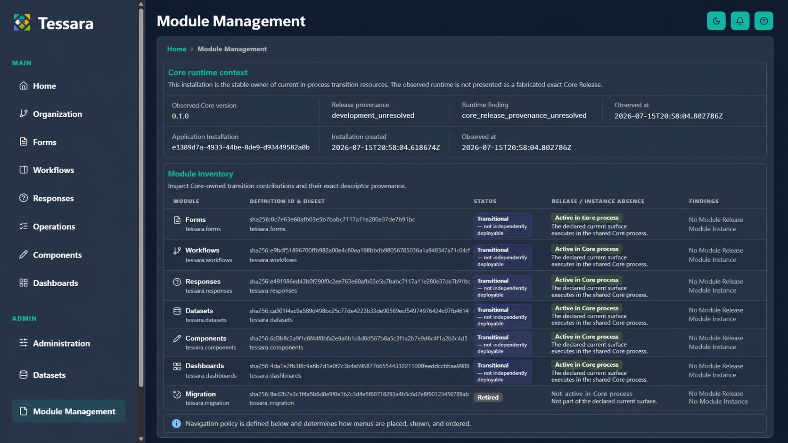
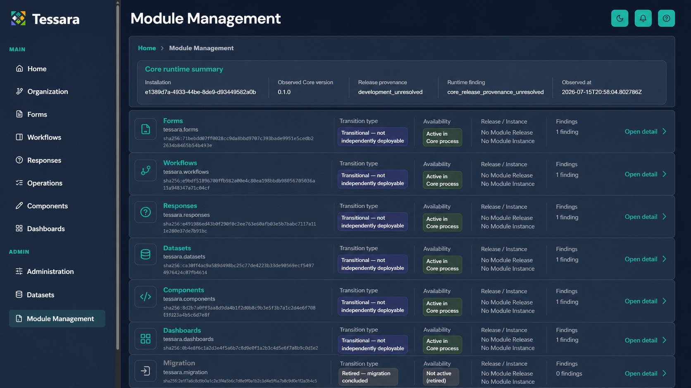
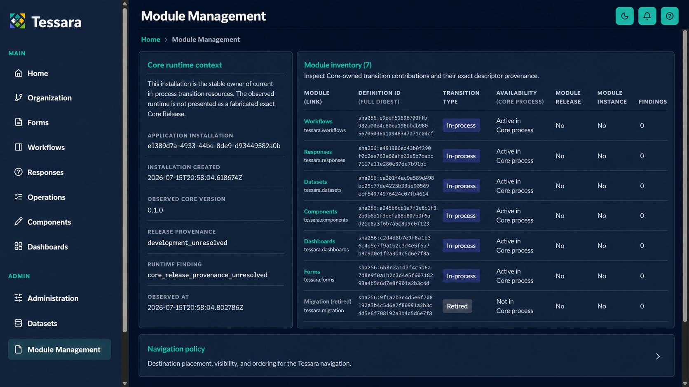

# Sprint 6A-UI Targeted Visual Directions

Status: product selection pending. These are screenshot-grounded layout directions for the Sprint 6A Module Management surfaces, not proposals to redesign the Tessara shell or add behavior.

All options preserve the current Tessara identity, shell, navigation groups/order, routes, data, lifecycle meanings, authorization, and policy controls. Generated text is illustrative; implementation must use exact live values and the accepted semantic behavior.

## Option 1: Operational Directory

- Compact full-width runtime summary followed by an intentional desktop data table.
- Closest to the current semantic structure and existing shared `DataTable` pattern.
- Primary implementation risk: fitting complete digest and explanation content without recreating density at tablet widths.

## Option 2: Registry Rows

- Each contribution is a full-width registry row with separated identity, transition, availability, Release/Instance, findings, and existing detail destination.
- Strongest scan hierarchy and most adaptable narrow-width stacking.
- Primary implementation risk: ensure list/card presentation preserves equivalent programmatic relationships and does not imply new actions.

## Option 3: Context Rail And Ledger

- Persistent runtime context at left and a compact contribution ledger at right, with Navigation policy continuing below.
- Makes the relationship between installation context and inventory visible while reducing vertical distance.
- Primary implementation risk: the two-column content frame must collapse cleanly and avoid giving runtime metadata too much width on tablet/mobile.

## Selection Contract

The selected direction is a layout/hierarchy decision only. Detail sections and policy controls will reuse its density, metadata, status, wrapping, and responsive treatment while retaining all current content and behavior. Any element that appears to add search, filtering, installation/lifecycle operations, new navigation, or new authorization is excluded.
