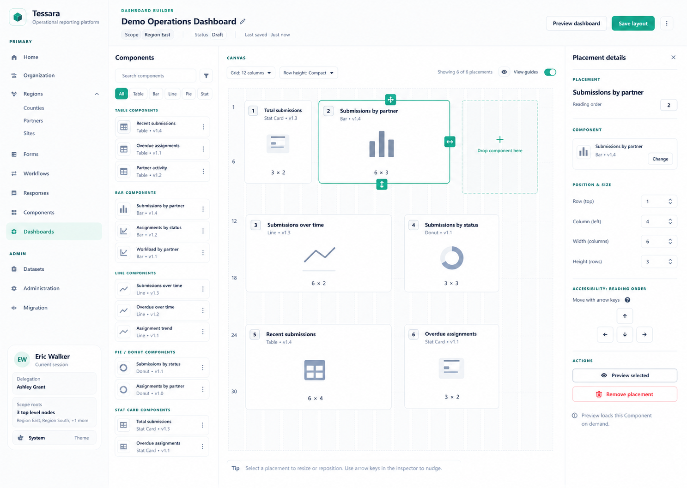

# Sprint 5A Dashboard Editor Design Decision

- Status: Implemented and validated on 2026-07-12
- Approved: 2026-07-12
- Clarified: 2026-07-12 after Sprint 5A consistency review
- Sprint: Sprint 5A Dashboard Composition Slice
- Decision owner: Product owner
- Implementation status: Implemented and closeout-validated on 2026-07-12

## Approved Reference

The approved direction uses Tessara's existing shell and a three-pane editor:

- a persistent scoped Component selector on the left;
- a shared 12-column placement canvas in the center;
- a persistent selected-placement detail panel on the right.

The canvas uses lightweight symbolic tiles rather than executing and rendering live Component output while the user arranges the layout.

## Reference Scope

- The approval gate applies only to the `/dashboards/:dashboard_id/edit` composition editor.
- Dashboard directory, create, detail, and focused-viewer surfaces follow established native Tessara patterns and are not visually gated by this image.
- The image's `Status Draft`, configurable grid/row-height, and guide-toggle controls are illustrative. Sprint 5A does not add a Dashboard publication lifecycle or user-configurable grid contract; the editor uses a fixed 12-column grid.
- The reading-order value shown in the inspector is derived and read-only. Movement controls change geometry, after which the server recalculates order.

## Product Decision

Sprint 5A will generalize the existing Form builder's framework-free placement rules and genuinely reusable low-level canvas/tile interactions for Forms and Dashboards. The approved Dashboard three-pane composition is Dashboard-owned and does not redesign the Form builder's current add-field or configuration-sheet experience.

The shared experience includes:

- a constrained 12-column grid;
- collision detection and deterministic reflow;
- drag/drop placement;
- width and height resizing;
- synchronized selection between tile and inspector;
- direct row, column, width, and height controls;
- keyboard-accessible movement and sizing;
- deterministic reading order;
- responsive single-column fallback behavior.

Forms and Dashboards provide feature-specific adapters. They do not consume each other's DTOs, API clients, or configuration types.

In the Dashboard editor, movement by pointer drag, keyboard control, or direct row/column edit into occupied geometry is valid and deterministically reflows affected placements. Pointer, keyboard, and direct width/height changes reject overlap or out-of-grid geometry and retain the last valid size. The Form adapter preserves its existing absolute direct-edit collision rejection.

## Approved Editor Experience

### Component Selector

- The left panel lists only scoped, placeable published or superseded Component versions.
- Rows show Component-kind icon, name, kind, and exact pinned version.
- Search and kind filtering operate on metadata only.
- The selector does not render Component thumbnails or execute Component endpoints.

### Placement Canvas

- The center canvas is the primary workspace and exposes the same placement model used by the Form builder.
- Dashboard placements render as consistent symbolic tiles with:
  - Component-kind icon;
  - placement title;
  - Component kind;
  - exact pinned version;
  - reading-order number;
  - width-by-height label;
  - drag and resize affordances when selected.
- Tiles do not contain live charts, tables, statistics, or Dataset rows.
- Drop targets, grid guides, invalid-target feedback, and the selected state remain visually clear without making the canvas look like a separate analytics workbench.

### Placement Details

- The right panel remains visible while a placement is selected.
- It owns title override, Component/version selection, row, column, width, height, read-only derived reading order, direct movement controls, preview, and removal.
- Selection in the canvas and detail panel is synchronized.
- Destructive removal remains visually separate from normal placement controls.

### Preview Behavior

- `Preview selected` lazily mounts and executes at most the currently selected exact Component version.
- Closing or changing the selected preview disposes the previous renderer and request state before another preview mounts.
- `Preview dashboard` opens the focused product-facing viewer and only then executes available Dashboard placements. It is disabled while unsaved or failed editor changes remain so preview never implies that a dirty composition was persisted.
- Exiting preview releases viewer resources; the iconographic editor remains mounted without live Component renderers.

## Shared Component Boundary

The implementation separates framework-free layout policy from Leptos interaction components. Exact public names may change during implementation, but responsibilities remain separate:

- `tessara-core::grid_layout`: `GridPlacement`, configurable constraints, bounds, occupancy, overlap, deterministic drag reflow, valid-size calculation, and row-major ordering;
- `tessara-web-ui::placement_editor`: grid canvas, drop targets, selection, drag state, resize state, symbolic tile shell, accessibility callbacks, and responsive interaction helpers;
- Dashboard feature: searchable Component and Placement-details side sheets, Dashboard-specific controls, save/dirty orchestration, and adapters into the shared grid/UI boundaries;
- Form feature: existing field-add and configuration-sheet UX adapted only to the shared geometry and low-level interactions that preserve current Form behavior.

The Form adapter maps `FormBuilderFieldDraft` geometry into the shared grid boundary. The Dashboard adapter maps stable ComponentVersion placement ids, display metadata, availability state, and Dashboard-specific controls without either feature consuming the other's DTOs or API clients.

## Placement Persistence Contract

Dashboard placement configuration becomes a versioned `DashboardPlacementConfigV1` and includes:

- `schema_version = 1`;
- `title`;
- `grid_row`;
- `grid_column`;
- `grid_width`;
- `grid_height`.

Dashboard grid constraints fix 12 columns, 240 maximum rows, and at most 240 stored placements. Row/column start at 1, width is 1 through 12 and must fit from its column, height may use every row remaining below its starting row, and the placement bottom edge must not exceed row 240. There is no smaller independent placement-height maximum. Every integer width and height inside those global bounds remains available when it satisfies the Component kind's minimum. Table enforces a `6 x 4` minimum but is not fixed at `6 x 4`: it may grow to width 12 and through every remaining Dashboard row. Bar, Line, Pie, Donut, Stat Card, and unknown future kinds retain the `1 x 1` hard minimum. Non-binding add defaults remain Table `6 x 4`, Bar `6 x 3`, Line `6 x 2`, Pie/Donut `3 x 3`, and Stat Card `3 x 2`; shared constraints retain code-defined per-kind minimum support without forcing a preset-only catalog.

The Demo Operations Dashboard uses the full `12 x 6` span for the content-heavy Session Log Table and retains `6 x 4` for simpler Tables; later placements are repacked below it without overlap.

Desktop tracks follow one non-user-configurable shared rule: target square cells, clamp rendered row height from 48px through 80px, and measure the actual DOM track for pointer calculations rather than assuming a fixed pixel value. Narrow layouts stack by derived reading order instead of applying desktop track height.

Pre-V1 arbitrary JSON ignores untyped geometry and receives deterministic single-column fallback for at most 240 placements by sorting fallback rows by signed `(position, placement_id)`, assigning the earliest available full-width rows from 1 while skipping rows occupied by valid V1 geometry, and using column 1, width 12, and height 1. This preserves fallback order without allowing one malformed or future-schema row to break an otherwise readable mixed-version Dashboard. Because `12 x 1` is below the Table minimum, legacy or undersized V1 Tables enter `config_state = "needs_repair"`, remain counted, and do not execute until repaired to at least `6 x 4`; valid fallback for other kinds may normalize normally. Unknown future schema versions use fallback geometry only for non-persisted display, retain raw JSON unchanged, and remain opaque. Sprint 5A provides no overflow repair list and never creates or saves a 241st placement. Seed data is repacked or removed as necessary to satisfy the placement and row cap. A deployment preflight reports each over-cap non-seed Dashboard id/count and aborts without mutation; the documented operator cleanup procedure must restore the invariant before the Sprint 5A application serves that database.

The existing `position` column remains server-derived zero-based normalized row-major reading, tab, API fallback, and narrow-screen order. UI labels are one-based and reading order is not independently editable.

Pinning means stable `component_version_id`, not immutable payload. Sprint 4A's explicit update-in-place action may change the current published version rendered under an existing id; publishing a separate new version never repins the placement automatically, and superseded versions remain immutable.

Dashboard composition saves through one transactional full-layout reconcile command. Existing rows are referenced by opaque placement id so a redacted row can be retained, moved, resized, or removed without exposing its binding; add/replace commands carry an authorized `component_version_id`. Movement interactions submit the already reflowed final geometry for every affected row, so the server validates rather than guesses drag intent. The server authorizes the Dashboard before candidate validation, locks it, validates the entire proposed composition, derives reading order, updates retained rows in place, inserts only explicit additions, deletes only explicit removals, and rolls back everything when any placement fails. Stable opaque placement ids are never regenerated by a delete-all/reinsert save. Server validation enforces:

- row and column start at 1;
- width fits inside the 12-column grid;
- height remains within the supported bound;
- the submitted final layout does not overlap;
- the Dashboard contains at most 240 stored placements and no placement extends beyond row 240;
- configured per-Component-kind minimum dimensions are satisfied while every otherwise valid integer span remains available;
- reading order is deterministic;
- add/replace commands reference only placeable exact Component versions; legacy or newly inaccessible stored bindings may remain only as non-executing redacted placements until retained, repaired, or removed;
- Dashboard visibility and the manager's Dashboard scope fully contain each placed Component's Dataset visibility.

Dashboard metadata/scope updates acquire the same Dashboard-row lock before validation, reject any proposed scope that would make an existing placement incompatible, and never remove placements implicitly.

## Performance Contract

The editor's initial load, search, selection, drag, resize, direct positioning, and save operations are metadata-only.

They must make zero Component execution requests.

Automated coverage will verify:

- opening a populated editor does not execute placed Components;
- moving or resizing placements does not execute Components;
- `Preview selected` executes no more than one selected exact version;
- a selected or focused-viewer Table preview uses the shared controlled, server-backed complete paged Table renderer, with pagination bounding the tile rather than truncating or client-paginating only one fetched result page;
- closing selected preview tears down its renderer before another preview starts;
- full Component execution begins only in `Preview dashboard` or the focused viewer;
- the focused viewer reserves all placement footprints but lazily mounts renderers near the viewport and applies the code-level `DASHBOARD_VIEWER_MAX_CONCURRENT_EXECUTIONS` ceiling below the 240-placement storage limit;
- returning to edit mode leaves no viewer renderers mounted.

This contract is the reason the placement tiles remain symbolic even though the product supports real Component previews elsewhere.

## Accessibility And Responsive Behavior

- Every drag/drop action has an equivalent direct or keyboard control.
- Selection, drop validity, saved state, and errors are announced without relying on color alone.
- Focus remains predictable after move, resize, preview close, and removal.
- Desktop exposes direct drag and resize handles.
- Narrow screens stack placements in deterministic reading order and use direct controls instead of requiring precision drag/resize gestures.
- `Preview selected` and `Preview dashboard` remain keyboard-operable and restore focus to their triggers when closed.

## Visual Direction

- Use the shipped Tessara token system and current 8px-radius posture; the approved image is a layout and interaction target, not permission to replace established tokens.
- Use the existing icon library for Component-kind, drag, resize, preview, movement, and removal actions.
- Keep the canvas visually dominant; present the Component selector and Placement inspector in accessible side sheets that do not permanently consume canvas width.
- Prefer spacing, alignment, typography, and dividers over nested cards or heavy elevation.
- Do not introduce legacy Report, Aggregation, Chart-asset, or workbench vocabulary.

## Non-Goals

- Simultaneously rendering every Component inside the composition editor;
- an unconstrained pixel-positioned design canvas;
- a separate Dashboard-only drag/drop implementation;
- copying Form DTOs or Form-specific UI into Dashboard code;
- forcing the Form builder into the Dashboard editor's Component/Placement side-sheet workflow;
- independently editable reading order;
- Dashboard `Draft` status, configurable grid columns/row height, or other illustrative mockup-only controls;
- Dashboard publication/version lifecycle beyond exact ComponentVersion placement;
- a fixed preset-only tile-size catalog;
- an overflow repair list for placements beyond the 240-placement/row contract;
- touch-dependent precision resizing on narrow screens.

## Approval Checklist

- [x] Persistent Component selector on the left.
- [x] Persistent selected-placement details on the right.
- [x] Shared Form/Dashboard grid placement model.
- [x] Iconographic, metadata-only placement tiles.
- [x] Explicit lazy preview for one selected placement.
- [x] Explicit full Dashboard preview/viewer.
- [x] Shared policy-neutral grid rules and low-level placement interaction primitives.
- [x] No application implementation before design approval.

The design approval gate is satisfied. Product-owner implementation authorization was received on 2026-07-12, and the implemented editor passed desktop/mobile visual QA and browser validation that day.
